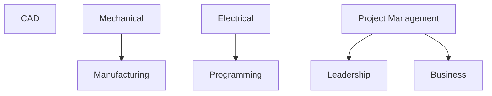
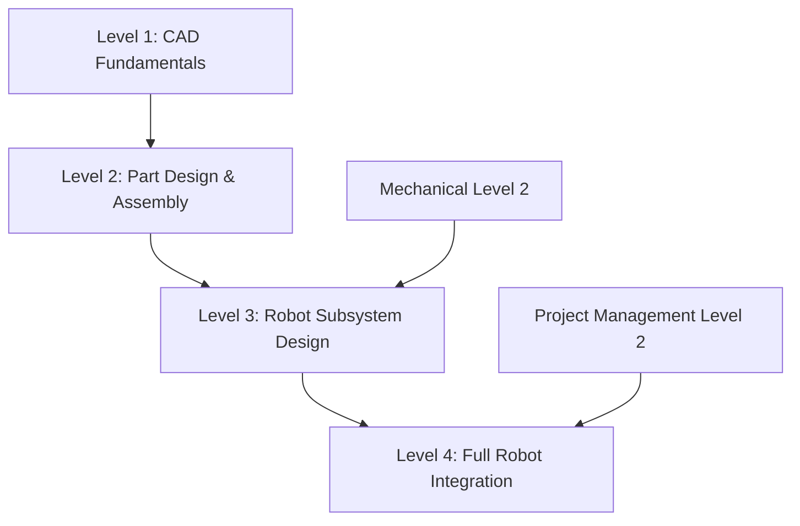
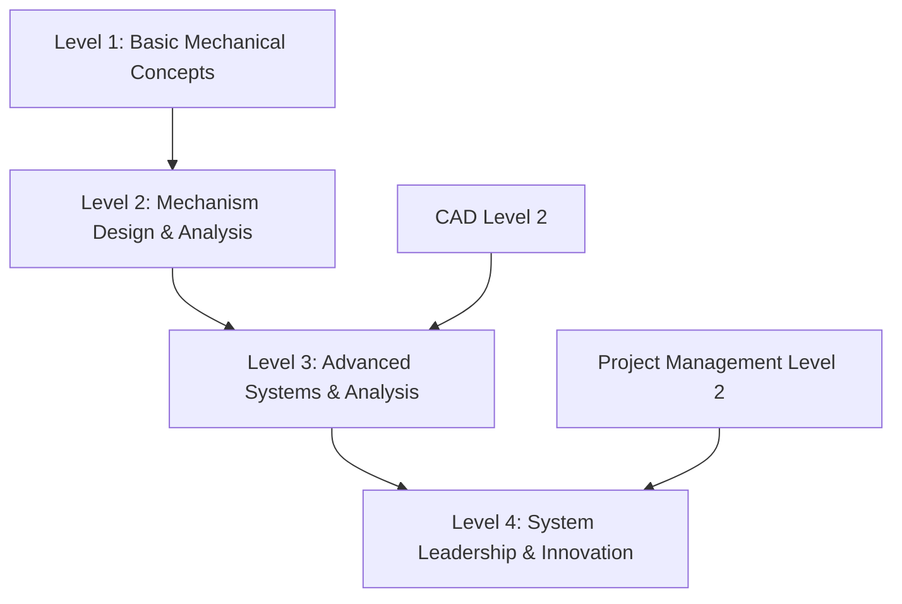
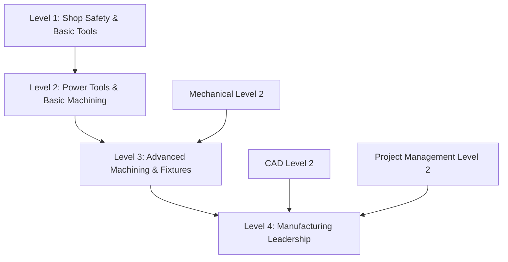
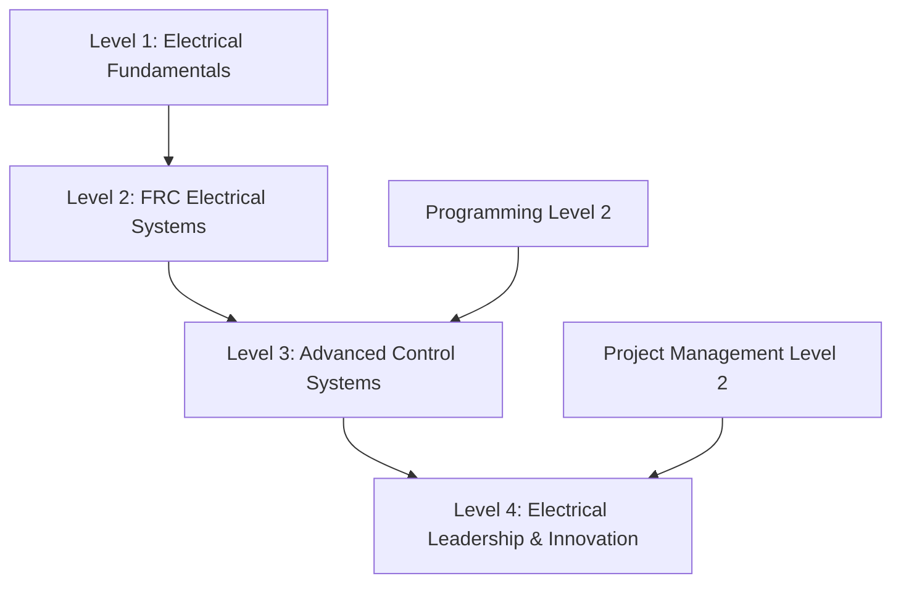
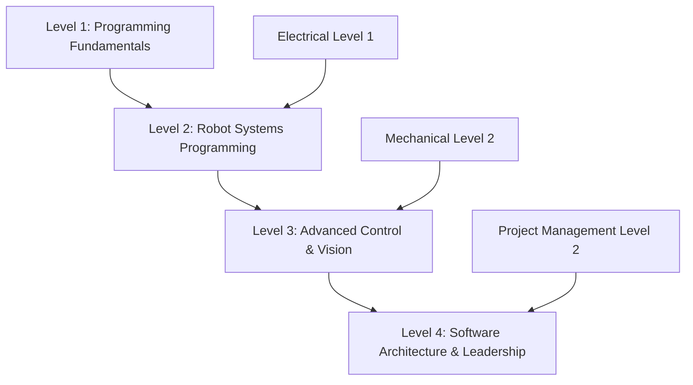
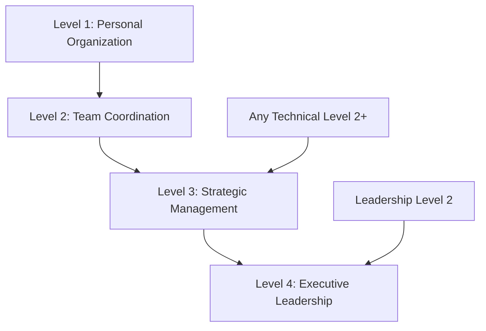
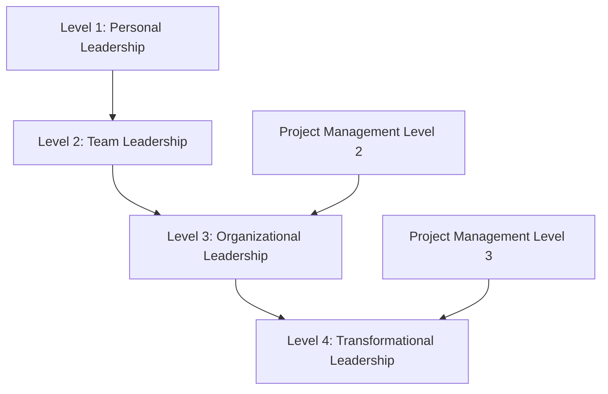
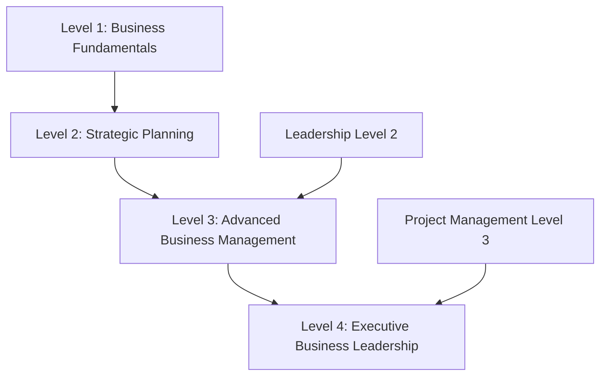

# Curriculum Prerequisites Visualization

## Module Dependencies

## Level Dependencies by Module

### CAD Level Prerequisites

### Mechanical Level Prerequisites

### Manufacturing Level Prerequisites

### Electrical Level Prerequisites

### Programming Level Prerequisites

### Project Management Level Prerequisites

### Leadership Level Prerequisites

### Business Level Prerequisites

